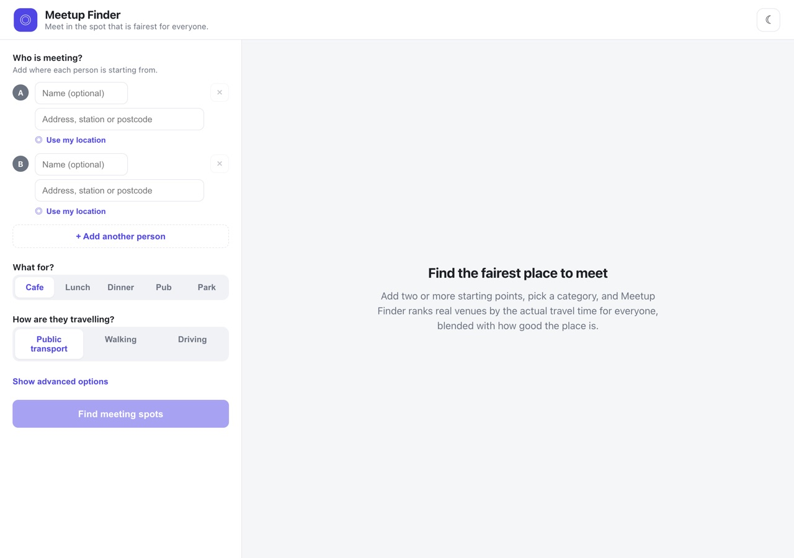
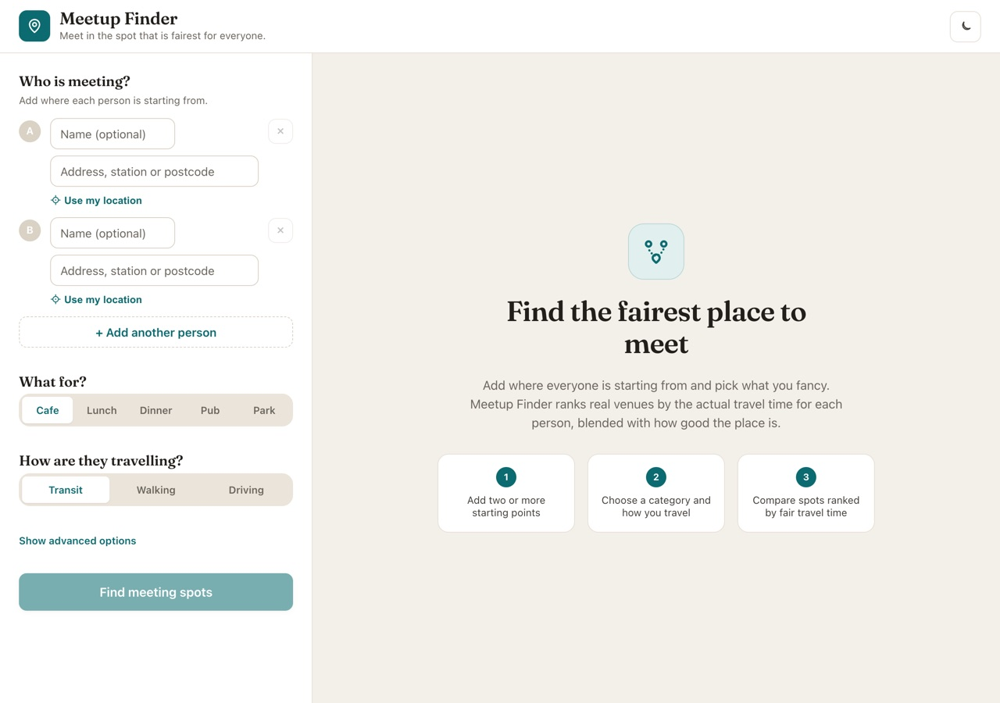
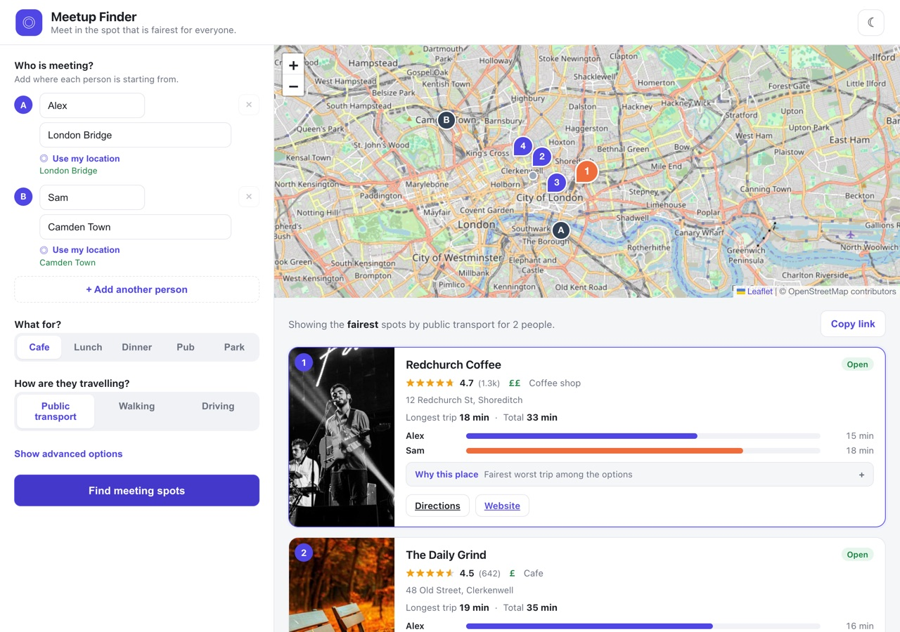
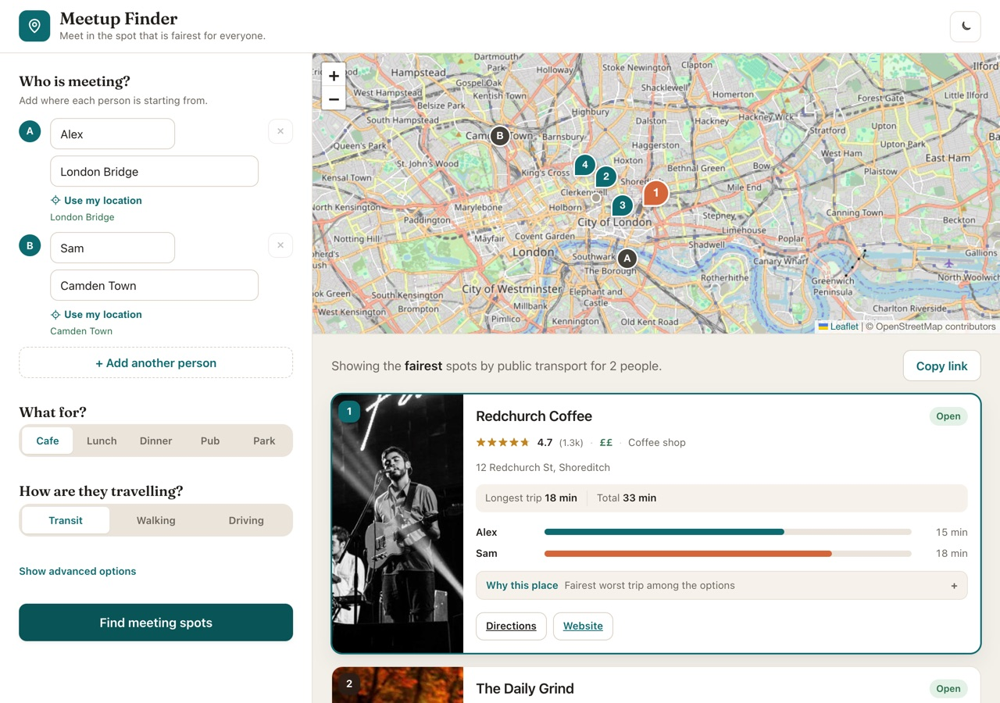
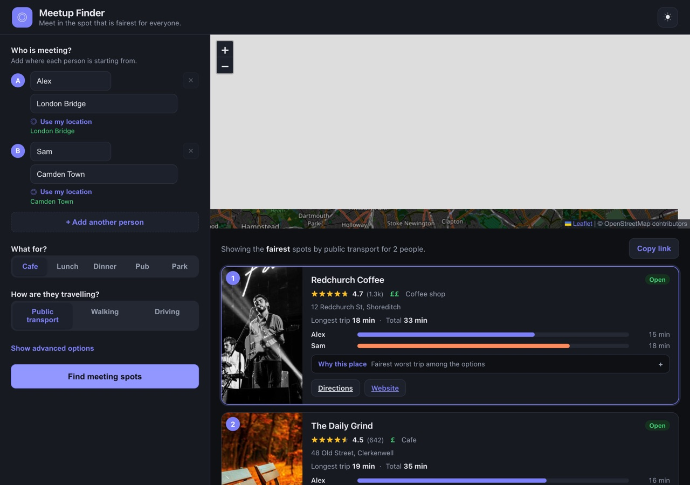
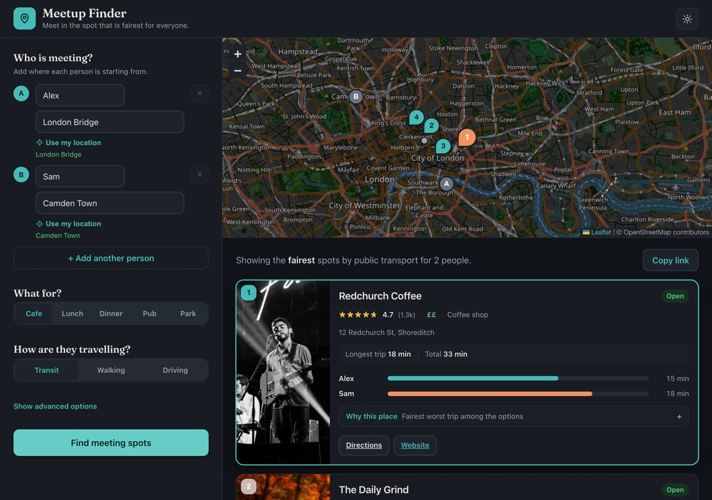
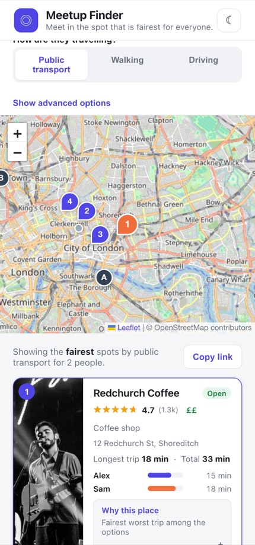
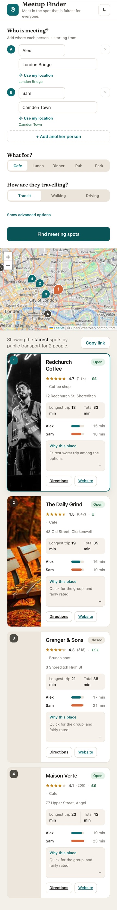

# Design notes: research led overhaul

This document is the written record asked for in issue #31. It captures three
things: what makes an interface read as "vibe coded", the practices we follow to
raise quality, and the way we worked with AI on the redesign. The second half
documents the design system those findings produced, including the colour
contrast evidence.

The goal was a considered redesign grounded in research, not change for its own
sake. Every token and component decision below ties back to a finding.

---

## Phase 1: research

### 1. What makes a site look AI generated or vibe coded

These are the recurring tells. The previous Meetup Finder UI hit most of them,
which is why it read as generic despite working well.

- **Default framework palette.** A saturated indigo or violet accent
  (`#4f46e5` and friends) is the single strongest giveaway. It is the Tailwind
  and shadcn default, so it signals "untouched starter". Bright blue to purple
  gradients are the same tell.
- **Generic hero plus card grid.** A centred headline, one line of body copy,
  and a wall of identical evenly spaced cards with no focal point.
- **Uniform spacing with no rhythm.** Equal gaps everywhere, so nothing groups
  and nothing leads. No sense of hierarchy between a section, its items, and the
  detail inside an item.
- **Default system fonts with no type scale.** Either the browser default, or a
  font named in the stack that is never actually loaded, plus a pile of one off
  pixel sizes (`12.5px`, `13.5px`, `16px`) chosen by feel rather than a scale.
- **No point of view.** Nothing about the type, colour, copy, or layout says
  what the product is or who made it. It could be any SaaS dashboard.
- **Emoji as iconography.** `◎`, `☀`, and `☾` standing in for a real icon set.
  Emoji render differently per platform and break the visual language.
- **Perfectly symmetric, lifeless layouts.** Everything centred and balanced,
  with no tension, no asymmetry, and no editorial voice.
- **No motion or feedback.** State changes happen instantly with no transition,
  hover, focus, or loading affordance, so the interface feels static.
- **Inconsistent radius and shadow scales.** A `14px` radius next to a `9px`
  one, or harsh single layer shadows, because the values were never defined as a
  set.

### 2. Best practices we follow

- **Type scale.** Pick a base size and a ratio (we use 16px and a 1.2 minor
  third) and derive every size from it. Pair each size with a line height tuned
  for that size. Give headlines a real display face so they carry voice.
- **Spacing system.** One spacing scale on a 4px base used for padding, gaps,
  and margins, so vertical rhythm is consistent and groups read as groups.
- **Colour system with contrast built in.** A small neutral ramp, one accent,
  and a set of semantic roles (good, warn, bad). Every text and interactive pair
  is checked against WCAG AA before it ships. See the table further down.
- **Layout and hierarchy.** Lead with the primary action and the primary metric.
  Group related fields. Let the most important number on a card be the loudest.
- **Motion and feedback.** Short, soft transitions on hover, focus, and
  selection. A visible keyboard focus ring on every control. Honour
  `prefers-reduced-motion`.
- **Empty and loading states.** Treat them as designed screens. The empty state
  should teach the product. The loading state should show progress, not a spinner
  in a void.
- **Content design.** Short, human copy that says what to do and what you get.

### 3. Working with AI on design

The reusable assets below are the ones we adopted for this work. They live here
so the next redesign can start from them.

**A reusable design system prompt**

> Act as a senior product designer. Before writing any CSS, define a design
> system as tokens: a type scale (base size and ratio), a spacing scale on a 4px
> base, a neutral colour ramp plus one accent and semantic roles, and radius,
> shadow, and motion scales. Give the product one clear point of view in three
> words. Justify the accent choice and confirm every text and interactive colour
> pair meets WCAG AA. Then apply the tokens to components. Avoid default
> framework palettes, emoji icons, uniform spacing, and unstyled empty or loading
> states.

**A critique checklist** we ran the UI through, before and after:

1. Could this be any starter template? If yes, what gives it a point of view?
2. Is the accent a framework default? Replace it with an intentional choice.
3. Is there a real type scale, or a pile of arbitrary pixel sizes?
4. Does spacing come from one scale, so groups read as groups?
5. Does every text pair pass AA contrast in both themes?
6. Are icons a real set, or emoji?
7. Do hover, focus, selection, empty, and loading states all exist and feel
   considered?
8. Is the most important information on each screen also the loudest?

**Reusable skills** we are keeping: drive everything from tokens rather than ad
hoc values; verify contrast with a script as part of the work rather than by eye;
capture before and after screenshots in light, dark, and mobile so changes are
reviewable.

---

## Phase 2: the design system

### Direction

Three words: **editorial, map inspired, calm**. The product helps people find a
fair place to meet, so the voice is warm and human rather than corporate. The
visual language pairs warm paper neutrals with a single cool petrol teal accent,
a display serif for headlines, and a steady spacing rhythm.

All tokens live in `apps/web/src/styles.css` as CSS custom properties, so the
dark theme, accessibility work (#13), and mobile layout (#29) consume the same
language rather than redefining it.

### Typography

- **Display face:** Fraunces (the optical size axis), self hosted via
  `@fontsource-variable/fraunces`. It is a characterful old style serif that
  gives the wordmark and headlines an editorial voice. Self hosting means no
  third party request and no layout shift.
- **UI face:** the native system stack, used on purpose. It renders instantly,
  feels at home on every platform, and spends no bytes, so the one web font we
  load goes to character where it counts. This also fixes the old bug where
  `Inter` was named in the stack but never loaded.
- **Scale:** 16px base, 1.2 ratio.

| Token | Size |
| --- | --- |
| `--text-xs` | 12px |
| `--text-sm` | 13px |
| `--text-base` | 15px |
| `--text-md` | 16px |
| `--text-lg` | 18px |
| `--text-xl` | 22px |
| `--text-2xl` | 28px |
| `--text-3xl` | 36px |

### Spacing, radius, shadow, motion

- **Spacing:** `--space-1` (4px) through `--space-10` (64px) on a 4px base.
- **Radius:** `--radius-xs` 6px, `--radius-sm` 10px, `--radius-md` 14px,
  `--radius-lg` 20px, `--radius-pill` 999px.
- **Shadow:** four soft layered steps (`--shadow-xs` to `--shadow-lg`) tinted
  with the ink colour so cards feel lifted, not outlined.
- **Motion:** `--motion-fast` and `--motion` for short, soft transitions.
  Everything is disabled under `prefers-reduced-motion`.

Older names (`--radius`, `--shadow`) are kept as aliases so nothing breaks.

### Colour and contrast

The accent moved off the default indigo (`#4f46e5`) to a petrol teal
(`#0c6b70` in light, `#45bdb6` in dark). Teal reads as maps and transit, sits
apart in hue from the green "open", amber "rating", and red "error" roles, and is
not a framework default. Neutrals are warm to support the paper feel.

Every text and interactive pair was checked against WCAG. All pass AA in both
themes; most clear AAA. Ratios were computed with a small WCAG script (shown in
the PR description) so contrast is verified rather than guessed.

| Pair | Light | Dark |
| --- | --- | --- |
| Body text on page | 14.4:1 | 15.0:1 |
| Text on cards | 16.4:1 | 13.7:1 |
| Muted text on cards | 5.6:1 | 6.6:1 |
| Links and interactive on cards | 6.3:1 | 7.5:1 |
| Primary button label | 6.3:1 | 7.4:1 |
| Open badge | 5.1:1 | 6.9:1 |
| Warning text | 4.6:1 | 7.6:1 |
| Error text | 5.4:1 | 6.2:1 |

### Component decisions

Each change ties to a finding above.

- **Brand mark and icons.** The emoji logo and the emoji location, sun, and moon
  glyphs are replaced with a small hand drawn line icon set (`components/icons.tsx`)
  that inherits `currentColor`. Fixes "emoji as iconography".
- **Headlines.** The wordmark, the panel questions, and the empty state headline
  use Fraunces. Gives the product voice. Fixes "no point of view" and "default
  fonts".
- **Empty state.** Was a centred sentence in a void. Now it has a piece of art, a
  serif headline, a short human paragraph, and a three step "how it works" row, so
  the first screen teaches the product. Fixes "unstyled empty state" and the
  "generic hero".
- **Result cards.** The primary fairness metric (longest trip) now sits in its
  own labelled panel so it leads, ratings and price form a clean meta row with
  separators, and the rank badge is a refined chip rather than a plain disc. The
  selected card gets an accent ring that matches its map pin, strengthening the
  card to map relationship. Fixes "no hierarchy" and "lifeless cards".
- **Controls.** Inputs, buttons, and the segmented control share the radius,
  shadow, and motion tokens, with hover, active, and a visible focus ring on
  every control. Fixes "no feedback" and "inconsistent scales", and helps #13.

---

## Before and after

Captured at desktop (light and dark) and mobile, with the API mocked so the full
results UI renders.

**Empty state, light**

| Before | After |
| --- | --- |
|  |  |

**Results, light**

| Before | After |
| --- | --- |
|  |  |

**Results, dark**

| Before | After |
| --- | --- |
|  |  |

**Results, mobile**

| Before | After |
| --- | --- |
|  |  |

---

## Coordination with related issues

This issue owns the visual language. The others consume it:

- **Dark mode and theming (#14):** both themes are defined as token sets, so a
  third theme is a new token block, not new component CSS.
- **Accessibility (#13):** AA contrast is verified for both themes, every control
  has a focus ring, and motion respects `prefers-reduced-motion`.
- **Mobile layout (#29):** sizes and spacing come from scales, so the responsive
  rules adjust tokens rather than fighting fixed pixels.
- **Loading skeletons (#19):** the skeleton and staged loader use the same track,
  radius, and motion tokens as the rest of the system.
